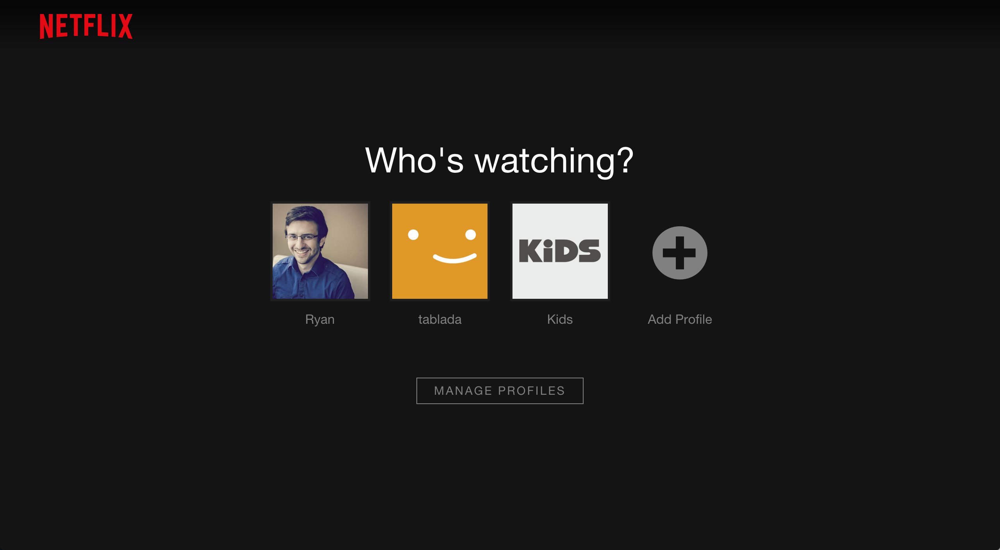

# Wednesday June 15

## Standups

* What's going well?
* What needs work?
* Share from the Field
* What have you learned?

## Topics

* [CSS Position](position.html)
* [CSS Position](position.html)
* [CSS Transform](transform.html)
* **[Breaking Down a Layout](layout-planning.html)**
  - Marker Analogy
  - Post-It Note
  - Jamaican-ized Approach
* **[Reusable Elements](reusable-elements.html)**

## Inspiration

### Netflix Profile

## Exercise & Lesson Code

https://github.com/TIY-TN-FEE-2016-spring/lesson-01-03

## Lab

## Video

* [Component Independence & Layout Strategies](https://youtu.be/ofSnkJ9tPPM)
  - Double Container
  - Negative Margin
  - `calc`
  - Outside In Layouts
  - Jamaican-ized Pattern
  - Don't use `height`?
  - Components vs Layout
  - Lobotomized Owl `* + *`

## Homework

https://online.theironyard.com/paths/379/units/2144/assignments/4877

## Resources

* (Box Model Playground)[http://codepen.io/anon/pen/dMOwmR?editors=0100]
