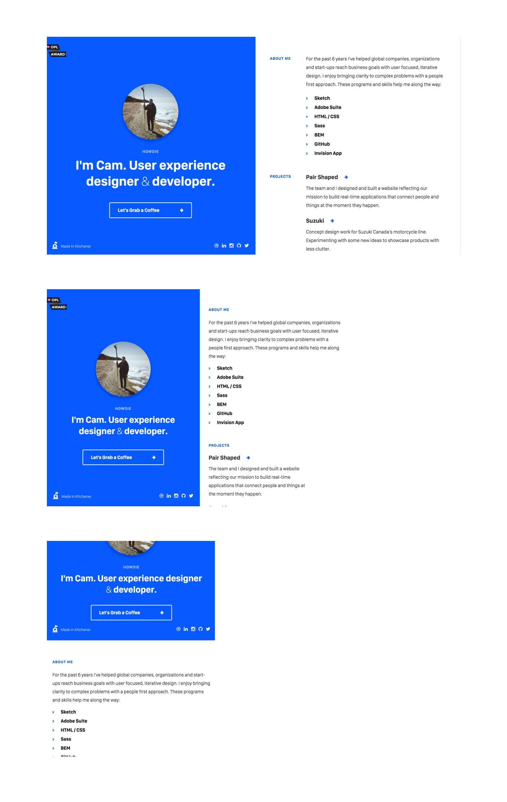

# Thursday June 23

## Daily JS

### Objects and an intro to `this`

```js
var x = function(one) {
  return one + 10;
};

var y = function() {
  return this.firstName;
};

var z = {
  firstName: 'John',
  lastName: 'Doe',

  somethingCool: x,

  getFirstName: y,

  fullName: function() {
    return `${this.firstName} ${this.lastName}`;
  },

  setName(first, last) { // setName: function(first, last) {
    this.firstName = first;
    this.lastName = last;
  },
};

console.log(x(12)); //
console.log(y()); //
console.log(z.firstName);  //
console.log(z.somethingCool(8)); //
console.log(z.getFirstName()); //
console.log(z.fullName()); //
z.setName('Han', 'Solo');
console.log(z.fullName()); //
z.firstName = "Luke";
z.lastName = "Skywalker";
console.log(z.fullName("Foo", "Bar")); //
z.lastName = "Organa";
console.log(z.fullName()); //
z.setName("Jar Jar");
console.log(z.fullName()); //
```

## Interruptions and Events

* 2PM - ¿ One on ones

## Standups

* What is going well?
* What is not going well (what are you struggling with)?
* What's something you'd like to share not about code?
* What's something you've learned

### Common Wins

*

### Common Struggles

*

## Topics

* Scrollable Areas
* Modifying Build Tools
* SASS Extends
  - CSS Gram
* SASS Mixins
  - Yoga Sass

## Inspiration




## Exercise & Lesson Code

https://github.com/TIY-TN-FEE-2016-summer/lesson-02-04

## Lab

## Homework
